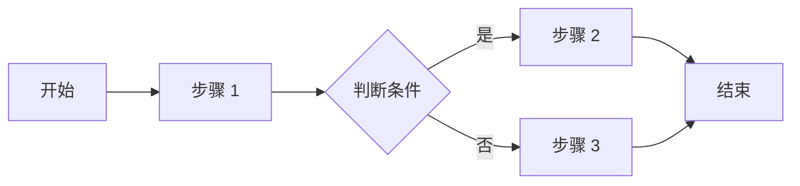

# PRD Generator

这个技能作为产品文档写作伙伴，帮助用户从产品想法推进到完整 PRD，包括信息收集、竞品研究、内容生成、流程图绘制和迭代优化。

## Core Capabilities

1. 交互式信息收集：逐步引导用户完善产品背景、目标用户、用户痛点、功能需求和非功能需求。
2. 竞品研究：搜索并分析竞品，提取核心功能、优劣势、差异点和产品启示。
3. 内容生成：基于输入自动扩展、润色和结构化 PRD 模块。
4. 流程图绘制：使用 Mermaid 生成清晰的功能流程图。
5. 模块反馈：对用户已写内容提供具体、可执行的优化建议。
6. 迭代优化：支持按模块调整、重写和补充信息缺口。
7. 标准化输出：生成符合评审使用场景的 PRD 文档。

## Basic Workflow

当用户请求 PRD 协助时：

1. 理解产品项目。
2. 创建或更新 PRD 大纲。
3. 识别信息缺口和待研究问题。
4. 按模块协作收集信息。
5. 必要时进行竞品研究。
6. 生成或优化功能流程图。
7. 输出完整 PRD。
8. 附上 review 清单，帮助用户进入评审。

常见用户请求：

```text
帮我创建一份 PRD，产品是一个 AI 驱动的会议纪要工具
帮我研究 AI 会议纪要领域的竞品
帮我完善用户痛点这个模块，目标用户是企业知识工作者
我写完了功能概述，帮我 review 一下
基于收集的信息，生成完整的 PRD 文档
Project Setup
如果用户需要在当前文件夹沉淀 PRD 文件，建议创建如下结构：

prd/
├── prd-draft.md
├── prd-v1.0.md
├── competitors.md
├── user-research.md
├── meeting-notes.md
└── assets/
    └── flowcharts/
不要强制创建文件；先根据用户目标判断是否需要落地文档。如果需要写文件，优先使用当前工作区内的项目目录。

Step 1: Understand the Product
先询问必要的澄清问题，一次聚焦一个模块，避免一次性问太多：

产品是什么，解决什么问题？
目标用户是谁？
产品目标是什么，包括业务目标和用户目标？
有没有参考竞品？
这是新产品还是迭代功能？
预期文档详细程度是什么？
当信息不足时，先给出一个可迭代的大纲，并明确哪些内容待确认。

Step 2: Create the PRD Outline
使用下面的大纲作为起点，根据产品类型裁剪：

# PRD 大纲: [产品名称]

## 文档信息
- 版本号: [待定]
- 负责人: [待定]
- 创建日期: [当前日期]

## 产品概述
- [ ] 产品背景
- [ ] 产品目标
- [ ] 目标用户
- [ ] 用户痛点
- [ ] 主要功能
- [ ] 竞品分析

## 功能需求
- [ ] 功能 1: [名称]
  - 功能概述
  - 用户场景
  - 功能流程
  - 前置条件
  - 后置条件
  - 异常场景

## 非功能需求
- [ ] 性能需求
- [ ] 算法指标，如适用

## 待研究
- [ ] [需要调研的问题 1]
- [ ] [需要调研的问题 2]
迭代大纲时，持续识别信息缺口、调整结构、标记需要深入研究的部分。

Step 3: Research Competitors
当用户请求竞品分析时：

搜索相关竞品信息。
分析核心功能、定位、用户规模、定价或商业模式。
提取优势、劣势和差异点。
总结对当前产品的启示。
如果信息来自网络或外部来源，标注来源链接。
输出格式：

## 竞品研究: [领域]

### 竞品 1: [名称]

**基本信息**
- 公司/团队: [信息]
- 用户规模: [信息]
- 核心定位: [信息]

**核心功能**
1. [功能 A]: [描述]
2. [功能 B]: [描述]
3. [功能 C]: [描述]

**优势**
- [优势 1]
- [优势 2]

**劣势**
- [劣势 1]
- [劣势 2]

**对我们的启示**
[分析总结，指出可借鉴和需避免的点]

### 竞品对比总结

| 维度 | 竞品 1 | 竞品 2 | 我们的机会 |
|------|--------|--------|------------|
| [维度 1] | [评价] | [评价] | [机会点] |
| [维度 2] | [评价] | [评价] | [机会点] |
Step 4: Generate Flowcharts
使用 Mermaid 语法生成清晰的功能流程图：

### 功能流程: [功能名称]



**流程说明**
1. **步骤 1**: [详细说明]
2. **判断条件**: [判断逻辑]
3. **步骤 2/3**: [分支说明]
流程图必须服务于需求表达。复杂逻辑用图，简单线性逻辑用列表即可。

Step 5: Review PRD Sections
当用户完成某个模块后，提供具体 review：

# 反馈: [模块名称]

## 做得好的地方
- [优点 1]
- [优点 2]
- [优点 3]

## 改进建议

### 具体性
- [模糊表述] -> [更具体的建议]
- [缺少数据] -> [建议补充的数据]

### 完整性
- [缺失的场景] -> [建议补充]
- [未考虑的边界] -> [建议考虑]

### 可执行性
- [不够明确的需求] -> [更清晰的表述]

## 具体修改建议

原文:
> [原始内容]

建议:
> [改进后的内容]

原因: [解释为什么这样改更好]

## 思考问题
- [引导深入思考的问题 1]
- [引导深入思考的问题 2]
反馈要尽量给可直接替换的文本，而不是只给抽象评价。

Content Standards
Product Background
建议覆盖市场现状、问题与机会、为什么是现在、团队或产品优势：

### 产品背景

#### 市场现状
[描述当前市场环境、行业趋势、用户行为变化]

#### 问题与机会
[描述发现的核心问题或市场机会]

#### 为什么是现在
[描述时机的重要性，为什么现在做这个产品]

#### 我们的优势
[描述团队/公司做这个产品的独特优势]
User Scenarios
用户场景要具体、有代入感：

### 用户场景

**场景 1: [场景名称]**

- **用户**: [用户角色]
- **背景**: [场景背景]
- **目标**: [用户想要达成的目标]
- **行为**:
  1. [步骤 1]
  2. [步骤 2]
  3. [步骤 3]
- **结果**: [期望的结果]
- **痛点**: [当前方案的痛点]
Exception Scenarios
异常场景要考虑触发条件、处理方式和用户提示：

### 异常场景

| 异常情况 | 触发条件 | 处理方式 | 用户提示 |
|----------|----------|----------|----------|
| [异常 1] | [条件] | [处理] | [提示语] |
| [异常 2] | [条件] | [处理] | [提示语] |
Final PRD Template
当信息收集完成后，生成完整 PRD：

# [产品名称] 产品需求文档

## 1. 文档信息

| 版本号 | 创建日期 | 负责人 | 状态 |
|--------|----------|--------|------|
| V1.0 | [日期] | [姓名] | 待评审 |

## 2. 修订历史

| 版本 | 修订内容 | 修订时间 | 修订人 |
|------|----------|----------|--------|
| V1.0 | 初稿创建 | [日期] | [姓名] |

## 3. 名词解释

| 术语 | 解释 |
|------|------|
| [术语] | [解释] |

## 4. 产品概述

### 4.1 产品背景
[详细内容]

### 4.2 产品目标
[详细内容]

### 4.3 目标用户
[详细内容]

### 4.4 用户痛点
[详细内容]

### 4.5 主要功能
[详细内容]

### 4.6 竞品分析
[详细内容]

## 5. 功能需求

### 5.1 [功能名称]

#### 功能概述
[详细内容]

#### 用户场景
[详细内容]

#### 功能流程
[Mermaid 流程图]

#### 前置条件
[详细内容]

#### 后置条件
[详细内容]

#### 异常场景
[详细内容]

### 5.2 非功能需求

#### 性能需求
[详细内容]

#### 算法指标
[如适用]

## 6. 参考资料
[引用链接]
PRD Review Checklist
生成文档后提供检查清单：

# PRD Review 清单

## 完整性检查
- [ ] 产品背景清晰，说明了为什么做
- [ ] 目标用户有明确画像
- [ ] 用户痛点有数据或案例支撑
- [ ] 竞品分析覆盖主要竞品
- [ ] 功能需求可执行、可验收
- [ ] 异常场景考虑全面

## 质量检查
- [ ] 无模糊表述，如“等”“相关”“合适的”
- [ ] 有量化指标，包括性能、算法等
- [ ] 流程图清晰完整
- [ ] 前后内容一致，无矛盾

## 可读性检查
- [ ] 结构清晰，层级分明
- [ ] 表格对齐，格式统一
- [ ] 术语有解释
Workflow Variants
新产品 PRD
明确产品想法和目标。
研究竞品和市场。
定义目标用户和痛点。
梳理核心功能。
逐个功能详细设计。
补充非功能需求。
整体 review 和优化。
输出正式文档。
迭代功能 PRD
明确迭代目标。
分析现有问题。
设计解决方案。
详细功能设计。
评估影响范围。
输出迭代 PRD。
快速 PRD
基于产品想法生成初稿。
请用户 review 和调整。
补充关键细节。
输出文档。
Best Practices
信息收集时一次只问一个模块，提供示例帮助理解，允许跳过后续补充，并记录待确认事项。
内容质量要做到每个需求可执行、可验收；用户场景具体、有代入感；异常场景全面；量化指标明确。
文档规范要统一标题层级、表格格式、术语解释和版本号。
避免模糊表述，少用“等”“相关”“合适的”等无法验收的词。
复杂逻辑优先使用流程图表达。
每次大改动建议保存新版本，并及时同步给相关方 review。
Related Use Cases
生成 MRD，市场需求文档。
生成竞品分析报告。
生成用户故事地图。
生成功能规格说明书。
生成技术方案文档。
